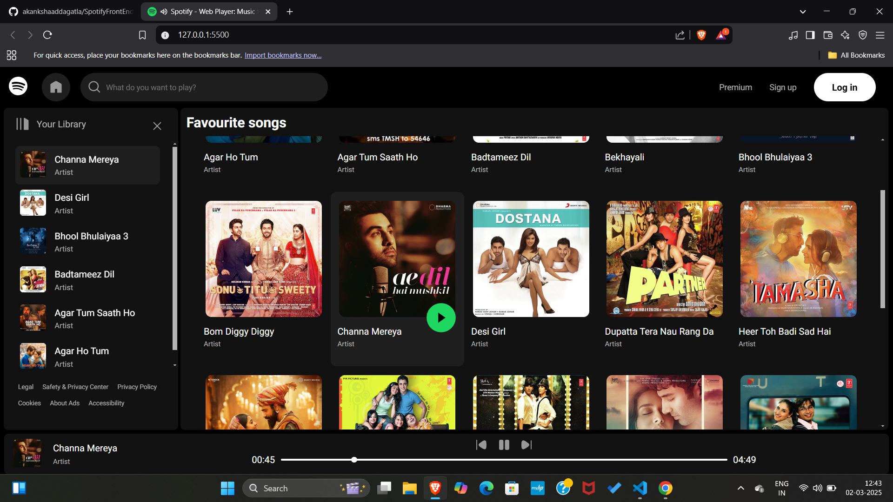

# 🎵 Spotify Clone

A simple Spotify clone built using HTML, CSS, and JavaScript.

## 🚀 Features
- 🎶 Fetches and plays songs from the `/songs` folder
- 📂 Displays song images from the `/songsImages` folder
- 🎵 Play, Pause, Next, and Previous controls
- 📜 Dynamic playlist generation
- 🎨 Responsive and interactive UI

## 📁 Project Structure
```
/your-project-folder
│── index.html          # Main HTML file
│── style.css           # Stylesheet
│── utility.css         # Additional styles
│── script.js           # Main JavaScript file
│── favicon.ico         # Spotify-style favicon
│── /songs              # Folder containing MP3 files
│── /songsImages        # Folder containing song cover images
│── /svgs               # Folder containing SVG icons (play, pause, etc.)
```

## 🛠️ Setup Instructions
1. Clone the repository:
   ```sh
   git clone https://github.com/akankshaaddagatla/SpotifyFrontEndClone.git
   ```
2. Navigate to the project folder:
   ```sh
   cd SpotifyFrontEndClone
   ```
3. Open `index.html` in your browser.

## 🎮 Usage
- Click on a song to play it.
- Use the play/pause button to control playback.
- Navigate through songs using the next and previous buttons.
- The current song is highlighted in the playlist.

## 📷 Screenshots


## ⚡ Technologies Used
- HTML
- CSS
- JavaScript

## Contribution ✨

Feel free to fork and improve the project! 🚀

Happy coding! 🎶
